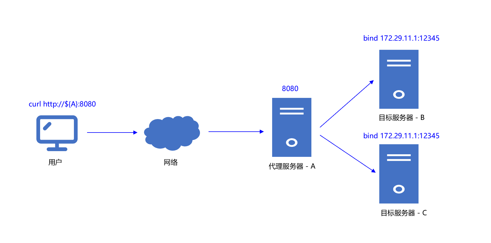

## nat_proxy

### 说明 

nat_proxy 利用数据包劫持、篡改技术实现数据包代理转发，对业务无侵入。  
相对传统nginx配置七层反向代理，可通过设置`X-Forwarded-For`头部传递客户端ip。  
但nginx四层反向代理，无法传递真实的客户端ip，需要设计用私有协议，携带客户端ip信息，对业务侧有侵入。 

### 编译 

- 安装依赖  
`yum install -y libpcap-devel`

- 编译  
`sh build.sh`

### 使用

  

#### 配置

1. 目标服务器B  

配置策略路由：  
`sh config/setup_tun.sh`

启动模拟服务：  
`./fakehttp -p tcp -a 172.29.11.1:12345`  

启动nat_server：  
`./nat_server -h "0.0.0.0" -p 62000`

2. 代理服务器A  

drop代理端口，防止内核回包：  
`iptables -I INPUT -p tcp --dport 8080 -j DROP`
  
启动转发服务：  
`./packet_proxy -i ${ethX} -P 8080 -R ${A} -r 62000 -h 172.29.11.1 -p 12345`
  

3. 客户端测试  

访问代理服务器A对外8080端口：`curl http://${A}:8080`  
B机器web服务打印：from sip=[$A_IP:$A_Port]  

